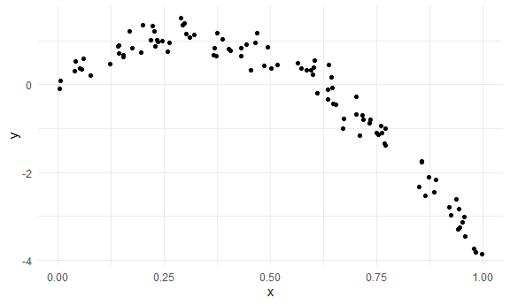
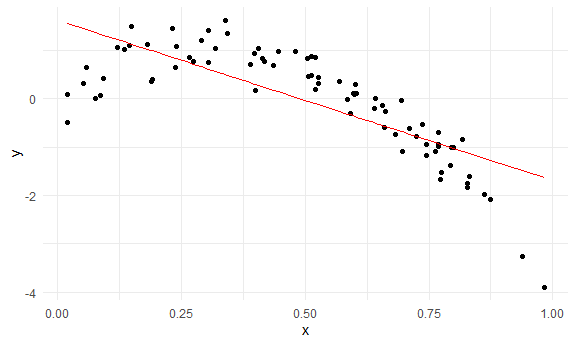
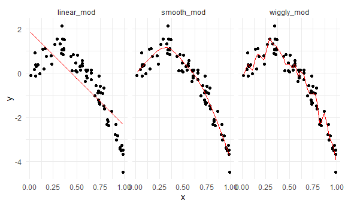
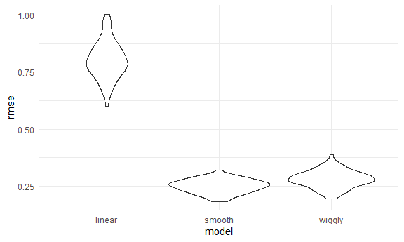
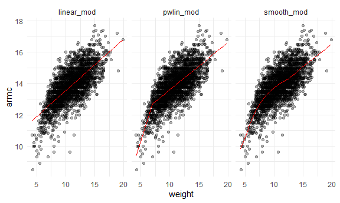
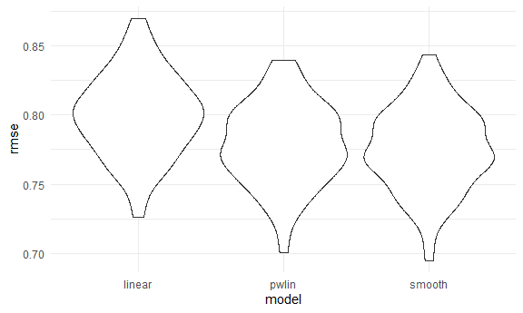

Cross Validation
================
Yu
November 23, 2020

Simulate data
-------------

``` r
nonlin_df = 
  tibble(
    id = 1:100,
    x = runif(100, 0, 1),
    y = 1 - 10 * (x - .3) ^ 2 + rnorm(100, 0, .3)
  )
```

Look at the data

``` r
nonlin_df %>% 
  ggplot(aes(x =x, y = y)) +
  geom_point()
```



Cross Validation -- by hand
---------------------------

Get training and testing datasets

``` r
train_df = sample_n(nonlin_df, size = 80)
test_df = anti_join(nonlin_df, train_df, by = 'id')
```

fit three models.

``` r
linear_mod = lm( y~x, data = train_df)
smooth_mod = gam(y~s(x), data = train_df)
wiggly_mod = gam(y~s(x, k = 30), sp = 10e-6, data = train_df)
```

Can I see what i just did?

``` r
train_df %>% 
  add_predictions(linear_mod) %>% 
  ggplot(aes(x = x, y = y)) + 
  geom_point() + 
  geom_line(aes(y = pred), color= 'red')
```



``` r
train_df %>% 
  gather_predictions(linear_mod, smooth_mod, wiggly_mod) %>% 
  ggplot(aes(x = x, y = y)) + 
  geom_point() + 
  geom_line(aes(y = pred), color= 'red')+
  facet_grid(.~model)
```



Look at prediction accuracy

``` r
rmse(linear_mod, test_df)
```

    ## [1] 0.9036193

``` r
rmse(wiggly_mod, test_df)
```

    ## [1] 0.3954732

``` r
rmse(smooth_mod, test_df)
```

    ## [1] 0.3170133

Cross Validation using 'modelr'
-------------------------------

``` r
cv_df = 
  crossv_mc(nonlin_df, 100)
```

What is happening here...

``` r
cv_df %>% pull(train) %>% .[[1]] %>% as_tibble()
```

    ## # A tibble: 79 x 3
    ##       id       x       y
    ##    <int>   <dbl>   <dbl>
    ##  1     1 0.490    0.638 
    ##  2     2 0.504    0.826 
    ##  3     3 0.0754   0.0115
    ##  4     4 0.440    1.05  
    ##  5     5 0.696   -1.09  
    ##  6     7 0.745   -0.955 
    ##  7     8 0.604    0.112 
    ##  8    10 0.513    0.487 
    ##  9    11 0.00275  0.0299
    ## 10    12 0.159    0.150 
    ## # ... with 69 more rows

``` r
cv_df %>% pull(test) %>% .[[1]] %>% as_tibble()
```

    ## # A tibble: 21 x 3
    ##       id      x        y
    ##    <int>  <dbl>    <dbl>
    ##  1     6 0.0645  0.241  
    ##  2     9 0.190   0.406  
    ##  3    14 0.847  -1.71   
    ##  4    18 0.696  -0.305  
    ##  5    19 0.675  -0.204  
    ##  6    23 0.770  -1.04   
    ##  7    29 0.828  -1.83   
    ##  8    32 0.0924  0.414  
    ##  9    44 0.585  -0.00919
    ## 10    47 0.514   0.659  
    ## # ... with 11 more rows

``` r
cv_df = 
  cv_df %>% 
  mutate(
    train = map(train, as_tibble),
    test = map(test,as_tibble)
  )
```

Let's try to fit models and get RMSE for them

``` r
cv_df = 
  cv_df %>% 
    mutate(
      linear_mod = map(.x = train, ~lm(y~x, data = .x)),
      smooth_mod = map(.x = train, ~gam(y~s(x), data = .x)),
      wiggly_mod = map(.x = train, ~gam(y~s(x, k = 30), sp = 10e-6, data = .x))
    ) %>% 
    mutate(
      rmse_linear = map2_dbl(.x = linear_mod, .y = test, ~rmse(model = .x, data = .y)),
      rmse_smooth = map2_dbl(.x = smooth_mod, .y = test, ~rmse(model = .x, data = .y)),
      rmse_wiggly = map2_dbl(.x = wiggly_mod, .y = test, ~rmse(model = .x, data = .y))
      )
```

What do these results say about model choice?

``` r
cv_df %>% 
  select(starts_with('rmse')) %>% 
  pivot_longer(
    everything(),
    names_to = 'model', 
    values_to = 'rmse',
    names_prefix = 'rmse_'
  ) %>% 
  ggplot(aes(x = model, y = rmse)) +
  geom_violin()
```



Compute averages

``` r
cv_df %>% 
  select(starts_with('rmse')) %>% 
  pivot_longer(
    everything(),
    names_to = 'model', 
    values_to = 'rmse',
    names_prefix = 'rmse_'
  ) %>% 
  group_by(model) %>% 
  summarise(avg_rmse = mean(rmse))
```

    ## `summarise()` ungrouping output (override with `.groups` argument)

    ## # A tibble: 3 x 2
    ##   model  avg_rmse
    ##   <chr>     <dbl>
    ## 1 linear    0.760
    ## 2 smooth    0.323
    ## 3 wiggly    0.366

Try on a real dataset
---------------------

import my data

``` r
child_grow_df = 
  read_csv('./data/nepalese_children.csv') %>% 
  mutate(
    weight_cp = (weight > 7) * (weight - 7)
  )
```

    ## Parsed with column specification:
    ## cols(
    ##   age = col_double(),
    ##   sex = col_double(),
    ##   weight = col_double(),
    ##   height = col_double(),
    ##   armc = col_double()
    ## )

weight vs arm circumference

``` r
child_grow_df %>% 
  ggplot(aes(x = weight, y = armc)) + 
  geom_point(alpha = .3)
```


fit the models I care about.

``` r
linear_mod = lm(armc ~weight, data = child_grow_df)
pwlin_mod = lm(armc ~ weight +weight_cp, data = child_grow_df)
smooth_mod = gam(armc ~ s(weight), data = child_grow_df)
```

``` r
child_grow_df %>% 
  gather_predictions(linear_mod, pwlin_mod, smooth_mod) %>% 
  ggplot(aes(x = weight, y = armc)) +
  geom_point(alpha = .3) +
  geom_line(aes(y = pred), color = 'red') +
  facet_grid(.~model)
```



Try to understand model fit using cross validation

``` r
cv_df = 
  crossv_mc(child_grow_df, 100) %>% 
  mutate(
    train = map(train, as_tibble),
    test = map(test, as_tibble)
  )
```

See if I can fit the models to the splits

``` r
cv_df = 
  cv_df %>% 
    mutate(
      linear_mod = map(.x = train, ~lm(armc~weight, data = .x)),
      smooth_mod = map(.x = train, ~gam(armc~s(weight), data = .x)),
      pwlin_mod = map(.x = train, ~lm(armc~weight + weight_cp, data = .x))
    ) %>% 
    mutate(
      rmse_linear = map2_dbl(.x = linear_mod, .y = test, ~rmse(model = .x, data = .y)),
      rmse_smooth = map2_dbl(.x = smooth_mod, .y = test, ~rmse(model = .x, data = .y)),
      rmse_pwlin = map2_dbl(.x = pwlin_mod, .y = test, ~rmse(model = .x, data = .y))
      )
```

Violin plot of RMSEs

``` r
cv_df %>% 
  select(starts_with('rmse')) %>% 
  pivot_longer(
    everything(),
    names_to = 'model', 
    values_to = 'rmse',
    names_prefix = 'rmse_'
  ) %>% 
  ggplot(aes(x = model, y = rmse)) +
  geom_violin()
```



``` r
cv_df %>% 
  select(starts_with('rmse')) %>% 
  pivot_longer(
    everything(),
    names_to = 'model', 
    values_to = 'rmse',
    names_prefix = 'rmse_'
  ) %>% 
  group_by(model) %>% 
  summarise(avg_rmse = mean(rmse))
```

    ## `summarise()` ungrouping output (override with `.groups` argument)

    ## # A tibble: 3 x 2
    ##   model  avg_rmse
    ##   <chr>     <dbl>
    ## 1 linear    0.800
    ## 2 pwlin     0.779
    ## 3 smooth    0.775
