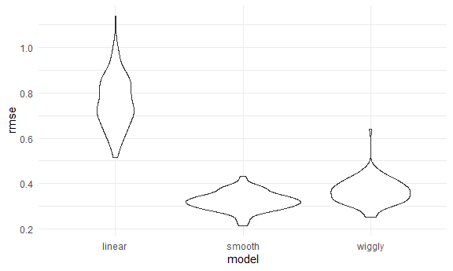

Cross Validation
================
Yu
November 23, 2020

Simulate data
-------------

``` r
nonlin_df = 
  tibble(
    id = 1:100,
    x = runif(100, 0, 1),
    y = 1 - 10 * (x - .3) ^ 2 + rnorm(100, 0, .3)
  )
```

Look at the data

``` r
nonlin_df %>% 
  ggplot(aes(x =x, y = y)) +
  geom_point()
```


Cross Validation -- by hand
---------------------------

Get training and testing datasets

``` r
train_df = sample_n(nonlin_df, size = 80)
test_df = anti_join(nonlin_df, train_df, by = 'id')
```

fit three models.

``` r
linear_mod = lm( y~x, data = train_df)
smooth_mod = gam(y~s(x), data = train_df)
wiggly_mod = gam(y~s(x, k = 30), sp = 10e-6, data = train_df)
```

Can I see what i just did?

``` r
train_df %>% 
  add_predictions(linear_mod) %>% 
  ggplot(aes(x = x, y = y)) + 
  geom_point() + 
  geom_line(aes(y = pred), color= 'red')
```


``` r
train_df %>% 
  gather_predictions(linear_mod, smooth_mod, wiggly_mod) %>% 
  ggplot(aes(x = x, y = y)) + 
  geom_point() + 
  geom_line(aes(y = pred), color= 'red')+
  facet_grid(.~model)
```


Look at prediction accuracy

``` r
rmse(linear_mod, test_df)
```

    ## [1] 0.8668018

``` r
rmse(wiggly_mod, test_df)
```

    ## [1] 0.2891189

``` r
rmse(smooth_mod, test_df)
```

    ## [1] 0.2613737

Cross Validation using 'modelr'
-------------------------------

``` r
cv_df = 
  crossv_mc(nonlin_df, 100)
```

What is happening here...

``` r
cv_df %>% pull(train) %>% .[[1]] %>% as_tibble()
```

    ## # A tibble: 79 x 3
    ##       id      x      y
    ##    <int>  <dbl>  <dbl>
    ##  1     1 0.375   1.18 
    ##  2     2 0.572   0.378
    ##  3     3 0.891  -2.16 
    ##  4     4 0.297   1.39 
    ##  5     5 0.0516  0.378
    ##  6     6 0.979  -3.73 
    ##  7     8 0.760  -0.944
    ##  8     9 0.227   1.22 
    ##  9    10 0.938  -2.61 
    ## 10    11 0.444   0.920
    ## # ... with 69 more rows

``` r
cv_df %>% pull(test) %>% .[[1]] %>% as_tibble()
```

    ## # A tibble: 21 x 3
    ##       id       x       y
    ##    <int>   <dbl>   <dbl>
    ##  1     7 0.00457  0.0977
    ##  2    12 0.768   -1.33  
    ##  3    19 0.736   -0.792 
    ##  4    26 0.154    0.634 
    ##  5    29 0.886   -2.45  
    ##  6    35 0.926   -2.98  
    ##  7    39 0.604    0.561 
    ##  8    43 0.873   -2.11  
    ##  9    48 0.857   -1.75  
    ## 10    56 0.771   -0.993 
    ## # ... with 11 more rows

``` r
cv_df = 
  cv_df %>% 
  mutate(
    train = map(train, as_tibble),
    test = map(test,as_tibble)
  )
```

Let's try to fit models and get RMSE for them

``` r
cv_df = 
  cv_df %>% 
    mutate(
      linear_mod = map(.x = train, ~lm(y~x, data = .x)),
      smooth_mod = map(.x = train, ~gam(y~s(x), data = .x)),
      wiggly_mod = map(.x = train, ~gam(y~s(x, k = 30), sp = 10e-6, data = .x))
    ) %>% 
    mutate(
      rmse_linear = map2_dbl(.x = linear_mod, .y = test, ~rmse(model = .x, data = .y)),
      rmse_smooth = map2_dbl(.x = smooth_mod, .y = test, ~rmse(model = .x, data = .y)),
      rmse_wiggly = map2_dbl(.x = wiggly_mod, .y = test, ~rmse(model = .x, data = .y))
      )
```

What do these results say about model choice?

``` r
cv_df %>% 
  select(starts_with('rmse')) %>% 
  pivot_longer(
    everything(),
    names_to = 'model', 
    values_to = 'rmse',
    names_prefix = 'rmse_'
  ) %>% 
  ggplot(aes(x = model, y = rmse)) +
  geom_violin()
```



Compute averages

``` r
cv_df %>% 
  select(starts_with('rmse')) %>% 
  pivot_longer(
    everything(),
    names_to = 'model', 
    values_to = 'rmse',
    names_prefix = 'rmse_'
  ) %>% 
  group_by(model) %>% 
  summarise(avg_rmse = mean(rmse))
```

    ## `summarise()` ungrouping output (override with `.groups` argument)

    ## # A tibble: 3 x 2
    ##   model  avg_rmse
    ##   <chr>     <dbl>
    ## 1 linear    0.802
    ## 2 smooth    0.249
    ## 3 wiggly    0.280
