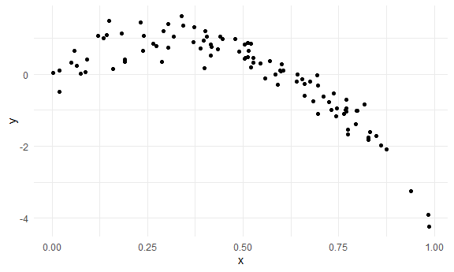
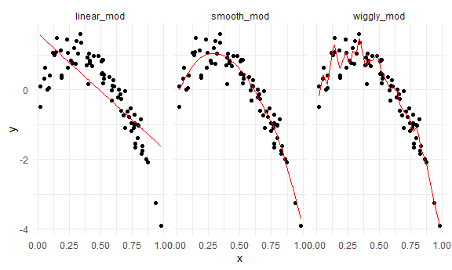

Cross Validation
================
Yu
November 23, 2020

Simulate data
-------------

``` r
nonlin_df = 
  tibble(
    id = 1:100,
    x = runif(100, 0, 1),
    y = 1 - 10 * (x - .3) ^ 2 + rnorm(100, 0, .3)
  )
```

Look at the data

``` r
nonlin_df %>% 
  ggplot(aes(x =x, y = y)) +
  geom_point()
```



Cross Validation -- by hand
---------------------------

Get training and testing datasets

``` r
train_df = sample_n(nonlin_df, size = 80)
test_df = anti_join(nonlin_df, train_df, by = 'id')
```

fit three models.

``` r
linear_mod = lm( y~x, data = train_df)
smooth_mod = gam(y~s(x), data = train_df)
wiggly_mod = gam(y~s(x, k = 30), sp = 10e-6, data = train_df)
```

Can I see what i just did?

``` r
train_df %>% 
  add_predictions(linear_mod) %>% 
  ggplot(aes(x = x, y = y)) + 
  geom_point() + 
  geom_line(aes(y = pred), color= 'red')
```


``` r
train_df %>% 
  gather_predictions(linear_mod, smooth_mod, wiggly_mod) %>% 
  ggplot(aes(x = x, y = y)) + 
  geom_point() + 
  geom_line(aes(y = pred), color= 'red')+
  facet_grid(.~model)
```



Look at prediction accuracy

``` r
rmse(linear_mod, test_df)
```

    ## [1] 0.7731731

``` r
rmse(wiggly_mod, test_df)
```

    ## [1] 0.3236872

``` r
rmse(smooth_mod, test_df)
```

    ## [1] 0.2329831
