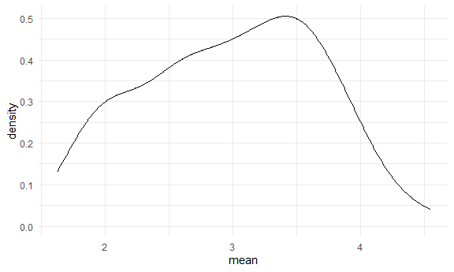
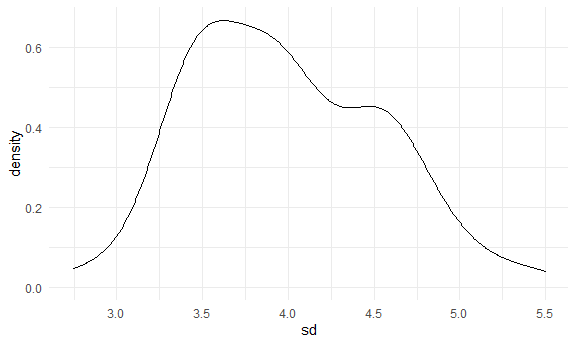

Simulation
================
Yu
November 23, 2020

Let's simulate something
------------------------

I have function

``` r
sim_mean_sd = function(sample_size, mu = 3, sigma = 4){
  sim_data = 
    tibble(
      x = rnorm(n = sample_size, mean = mu, sd = sigma)
    )
  sim_data %>% 
    summarise(
      mean = mean(x),
      sd = sd(x)
    )
}
```

I can `simulate` by running this line

``` r
sim_mean_sd(30)
```

    ## # A tibble: 1 x 2
    ##    mean    sd
    ##   <dbl> <dbl>
    ## 1  2.92  4.21

Let's simulate a lot
--------------------

Let's start with a for loop

``` r
output = vector('list', 100)

for(i in 1:100){
  
  output[[i]] = sim_mean_sd(30)
}

bind_rows(output)
```

    ## # A tibble: 100 x 2
    ##     mean    sd
    ##    <dbl> <dbl>
    ##  1  2.84  4.11
    ##  2  3.51  2.78
    ##  3  4.61  3.73
    ##  4  1.26  3.18
    ##  5  2.46  3.99
    ##  6  3.80  3.45
    ##  7  3.17  4.39
    ##  8  3.37  4.25
    ##  9  4.11  5.05
    ## 10  2.50  3.60
    ## # ... with 90 more rows

Let's use a loop function.

``` r
sim_results = 
  rerun(100, sim_mean_sd(30)) %>% 
    bind_rows()
```

Let's look at results ..

``` r
sim_results %>% 
  ggplot(aes(x = mean)) + geom_density()
```



``` r
sim_results %>% 
  summarise(
    avg_samp_mean = mean(mean),
    sd_samp_mean = sd(mean)
  )
```

    ## # A tibble: 1 x 2
    ##   avg_samp_mean sd_samp_mean
    ##           <dbl>        <dbl>
    ## 1          2.99        0.688

``` r
sim_results %>% 
  ggplot(aes(x = sd)) + geom_density()
```


